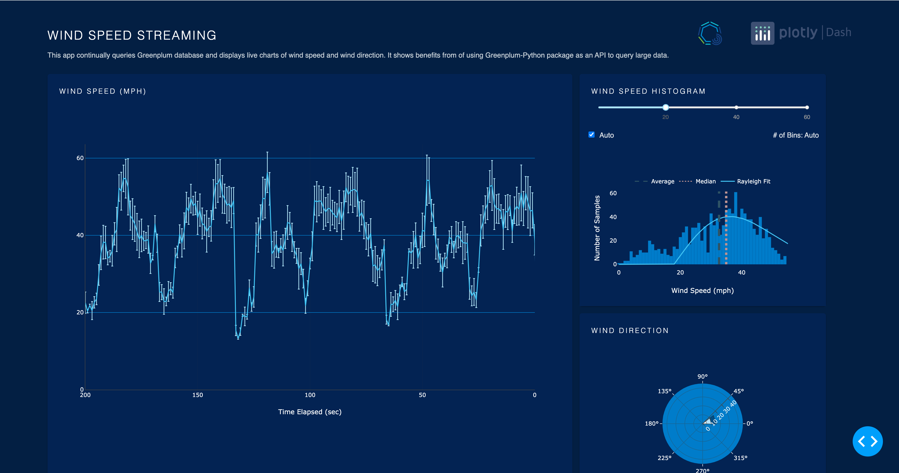

# Beyond BI: Data Analytics with Greenplum and Dash

## About this app

This Dash app queries a [Greenplum data-warehouse](https://www.vmware.com/products/greenplum.html) every second and uses the data to update the wind speed diagram and the wind direction diagram. 
The wind speed values are then binned in real time to generate the wind histogram plot.

## How to run this app

Install the requirements:

```bash
pip install -r requirements.txt
```
Run the app:

```bash
python app.py
```
Open a browser at http://127.0.0.1:8050

## Screenshot


